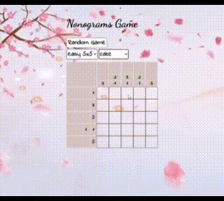

# nonograms-game

### Deploy: [`ссылка на готовую работу`](https://besyashka.github.io/nonograms-game/nonograms/) ###

---
**Nonograms (японский кроссворд)** — головоломка, в которой, в отличие от обычных кроссвордов, закодированы не слова, а зашифровано некоторое изображение, с помощью цифр. Целью головоломки является полное восстановление этого изображения.

_Цифры, указанные слева и сверху кроссворда_ - описывают группы закрашенных клеток (идущих подряд, без пропусков) по горизонтали и вертикали соответственно. Порядок цифр описывает порядок расположения этих групп, но где каждая группа начинается и заканчивается - не известно.

Каждая отдельная цифра обозначает отдельную группу заданного размера (т.е. цифра 5 - обозначает группу из пяти закрашенных подряд клеток, 1 - группу из одной единственной закрашенной клетки). Между группами должна быть как минимум одна не закрашенная клетка.  

**Как решать японские кроссворды:**
---

При решении рассматривается каждая строка/столбец в отдельности, постоянно переходя к следующим столбцам и строкам. При этом процесс решения в каждой строке/столбце сводится к:  
1. Определение клеток, которые точно будут закрашены (при любом возможном расположении групп) - их мы и закрашиваем.
2. Определение клеток, в которых наличие закрашенных клеток невозможно - такие клетки зачеркиваются крестиком (иногда вместо крестика используется жирная точка).
3. Определение цифр, положение которых уже вычислено - обычно эти цифры зачеркиваются.